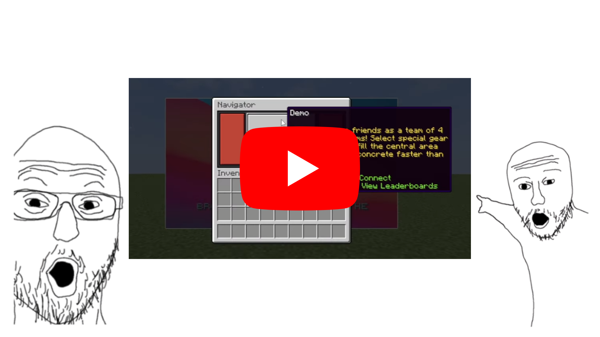

> [!NOTE]
> If you need help using or setting these up please join the [Discord Server](https://discord.gg/KRRybNJ5Cp) and ping me.

# vanilla-shaders
A small collection of some cool effects ive made using shaders for Minecraft.

## Bossbars

> Should work for alot of versions but was tested on 1.21.8 and 1.21.10 (doesnt even use shaders :pensive:)

## Item hover

> Made for 1.21.8 and is broken since 1.21.9 due to rendering changes.

